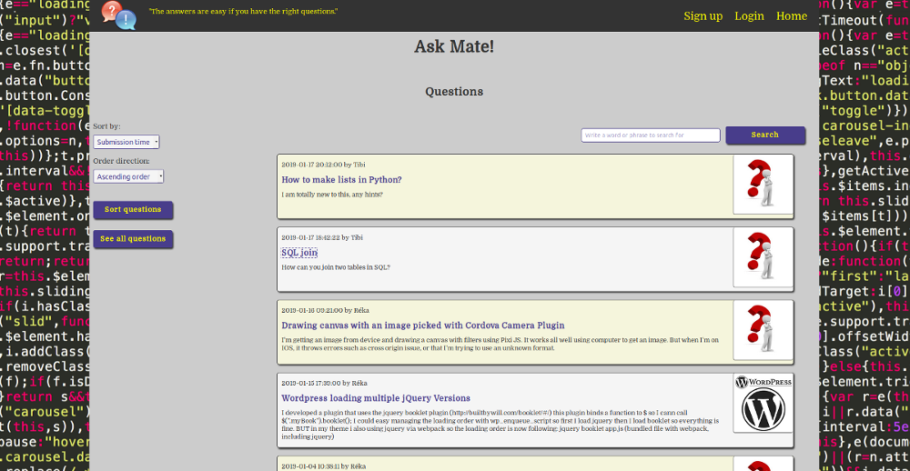
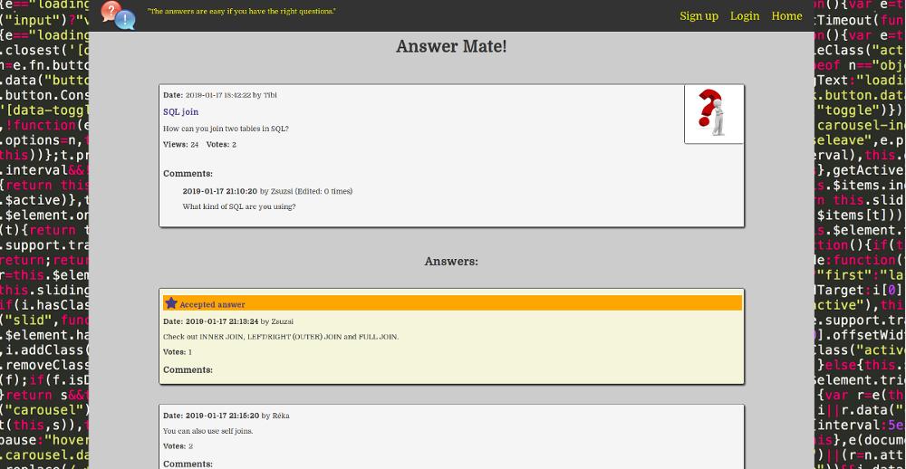

### Web and SQL with Python / Ask Mate project

The assignment was to implement a crowdsourced Q&A site, like Stack Overflow. Questions related to programming can be searched by any visitors of the site, and they can be asked, answered, commented and voted on by logged-in users. There is also a user reputation system and best answers can be marked as accepted.

Technologies: Python / Flask, PostgreSQL, HTML5, CSS3, JavaScript.

